# Paytm Maadi

### You say it. AI gets it done.

**Paytm Maadi** is an AI merchant growth partner for small Indian businesses, built as an intelligent layer inside the Paytm merchant experience. A shop owner simply says what they need — in Kannada, Kanglish, Hindi, Hinglish or English — and Maadi understands the business, explains what is changing and why, simulates the options, acts **only after approval**, tracks the outcome and learns from it.

> **Hackathon prototype.** Not an official Paytm product. The merchant, customers and transactions are simulated demo data. Maadi never moves real money — payments run on Paytm's **staging** gateway with test money only.

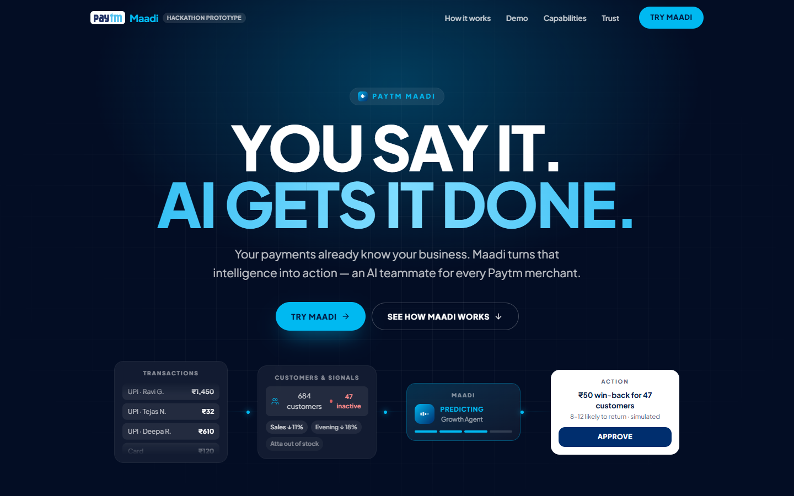

---

## Contents

- [The problem](#the-problem)
- [What Maadi does](#what-maadi-does)
- [The 90-second story](#the-90-second-story)
- [Feature tour](#feature-tour)
- [Screenshots](#screenshots)
- [Architecture](#architecture)
- [Tech stack](#tech-stack)
- [Getting started](#getting-started)
- [Environment variables](#environment-variables)
- [Demo script for judges](#demo-script-for-judges)
- [API reference](#api-reference)
- [Project structure](#project-structure)
- [Safety, privacy and trust](#safety-privacy-and-trust)
- [Troubleshooting](#troubleshooting)
- [Limitations and roadmap](#limitations-and-roadmap)

---

## The problem

Small merchants already generate a huge amount of business data through payments, customers, stock, invoices and cash. But that data mostly tells them **what happened** — not **what to do next**. Dashboards make the merchant do the analysis, the decision and the follow-through themselves.

## What Maadi does

Maadi turns business data into one continuous loop:

**UNDERSTAND → PREDICT → PROTECT → DECIDE → ACT → LEARN**

| Traditional merchant software | Paytm Maadi |
| --- | --- |
| Data → dashboard → *you* analyse → *you* decide → *you* act | Data → AI understands → AI explains → AI simulates → **you approve** → AI acts → AI learns |

It behaves like **one AI teammate** with several capabilities, not a set of unrelated features. Growth is the primary story; inventory, cashflow, safety, credit readiness, documents and digitalization strengthen it.

---

## The 90-second story

Every number below comes from calibrated seed data, so every screen tells the same story.

| Step | Merchant | Maadi |
| --- | --- | --- |
| 1 | Opens Maadi | *"Good morning, Manjunath. I've found 3 things that need your attention."* |
| 2 | 🎙️ *"Nanna sales ee vaara yaake kadime aagide?"* | Sales are **down 11%** (₹38,400 vs a normal ₹43,150). Main reason: **47 regular customers** haven't purchased in 14 days. Evidence: evening transactions −18%, Aashirvaad Atta out of stock for 3 days. |
| 3 | *"₹50 offer kotre enagutte?"* | **Simulated estimate:** 8–12 customers likely return, ₹4,200–₹6,300 incremental sales, ROI ~2.5×. *"I can create this campaign for 47 customers."* |
| 4 | Taps **APPROVE** | *"Campaign created for 47 customers."* |
| 5 | Watches it run | Live tracking: sent → delivered → opened → returned. **+14 customers, ₹5,800, ROI 2.8×.** |
| 6 | — | **LEARNING COMPLETE** — *"This campaign performed better than expected."* Future win-back estimates are recalibrated. |

Open **`/demo`** and this plays automatically inside the real app, then continues into cashflow, inventory, QR safety and credit readiness.

---

## Feature tour

### Landing page (`/`)
A cinematic product story rather than a feature grid: animated signal flow in the hero, a scroll-driven *problem* section where disconnected signals converge into Maadi's summary, the UNDERSTAND→LEARN loop, a 10-step *How it works* timeline, a fully animated **product demo player** (play, pause, replay, skip, mute, progress — built from real UI components, no video file), a *Not another dashboard* comparison, an interactive capabilities hub, a voice section cycling through five languages, trust and explainability, and a closing CTA.

### Live application (`/app`)
The real, working merchant app, in two presentations of the **same** React tree:

- **📱 Phone mode** (desktop default) — the app inside a realistic smartphone frame with status bar, dynamic island and subtle parallax.
- **▣ Normal mode** — the same mobile-first app in a responsive container.

Switching never remounts the app, so the current screen, chat, pending approvals, campaigns and demo progress are all preserved. On real phone-sized screens the app always runs full-screen. Share a mode with `?presentation=phone` or `?presentation=normal`.

### Maadi command center
Ask by text or voice, or tap suggested prompts. Every answer is grounded in merchant data and shows:
- the responsible **agent** and a **confidence** label (*Likely*, *Estimated*, *Based on current data*, *Not enough data to be certain*),
- evidence cards and an expandable **“Why Maadi thinks this”**,
- honest **uncertainty** notes,
- a visible agent state: LISTENING → UNDERSTANDING → ANALYZING → PREDICTING → PLANNING → WAITING FOR APPROVAL → EXECUTING → LEARNING,
- action proposals with **APPROVE / EDIT / CANCEL** (editing re-runs the simulation live).

### Supporting intelligence

| Capability | What it does |
| --- | --- |
| **Growth** | Sales trends, peak hours, best and declining products, customer segments, churn risk (47 at-risk regulars with reasons), win-back campaigns and outcome tracking |
| **Merchant Twin** | What-if simulator for targeted win-backs vs store-wide discounts, with assumptions and a diminishing-returns curve |
| **Inventory** | Days of stock left, reorder points, supplier orders sized by case, invoice-driven stock updates |
| **Cashflow Guardian** | *Available now* vs *committed* vs *expected*; promised-away money (rent, suppliers, salaries, bills, mandates); detected recurring payments that are only counted once confirmed; **UPI mandate failure prediction** |
| **Safety** | Nine-signal explainable QR / beneficiary risk engine (LOW / MEDIUM / HIGH with *why*), a wrong-person transfer gate (CANCEL / I WANT TO CONTINUE), and an interactive merchant scam graph |
| **Credit readiness** | READY / ALMOST READY / NEEDS IMPROVEMENT with factor scores — Maadi never approves loans; lenders decide |
| **Documents** | Upload invoices, GST returns, bank statements or Udyam certificates; fields are extracted with confidence and inconsistencies (Gemini reads real files; sample templates otherwise) |
| **Digital catalog** | *"Ee biscuit packet ₹10, 25 pieces ide."* becomes a catalog item on a demo storefront |
| **Action history** | Audit log of every action (what, why, expected result, approved by, status) plus the learning loop (expected vs actual) |
| **Test payments** | *Receive a payment* on the QR tab runs a real Paytm staging checkout, verified server-side before it counts in today's sales |

### Voice-first
Tap the mic and speak. With a Sarvam key, audio is transcribed by **Sarvam `saaras:v3`** (Kanglish comes back as romanised text Maadi's intent rules understand) and replies can be spoken with **`bulbul:v3`**. Without a key, voice runs in a clearly labelled simulated mode where you tap a phrase.

---

## Screenshots

| Maadi finds the root cause | What-if simulation awaiting approval |
| --- | --- |
| 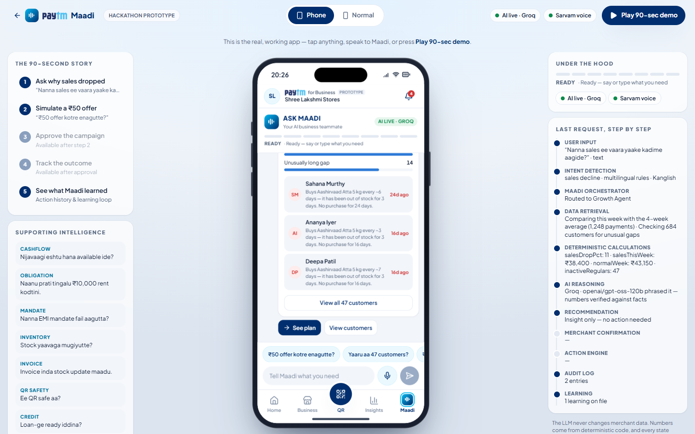 | 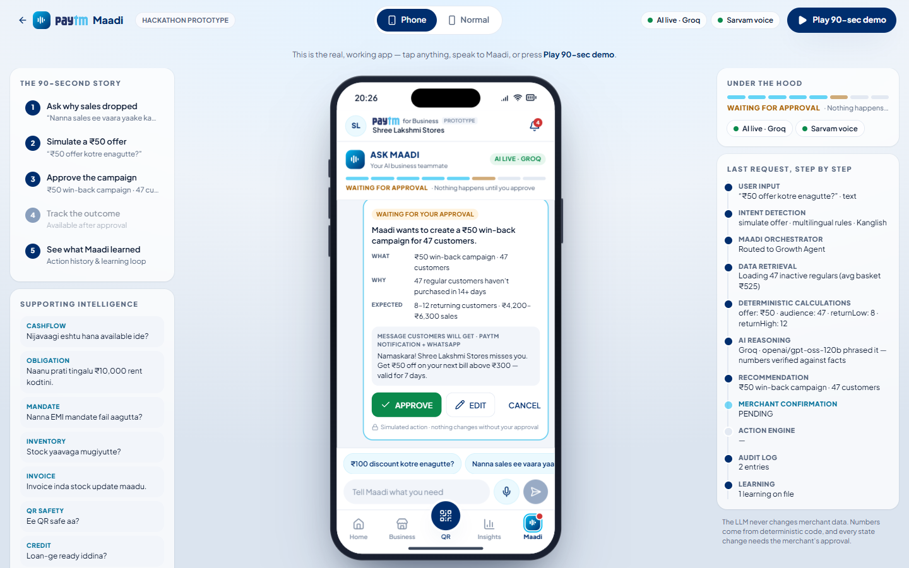 |

| Same app, Normal mode (state preserved) | Outcome tracked and learning complete |
| --- | --- |
| 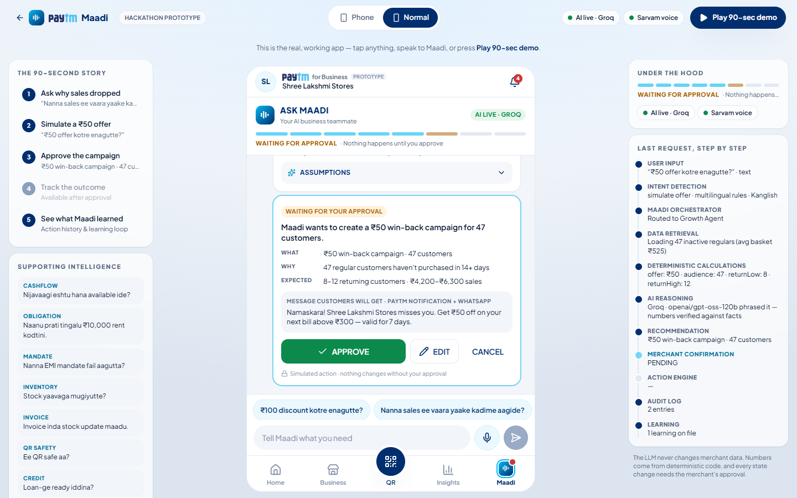 | 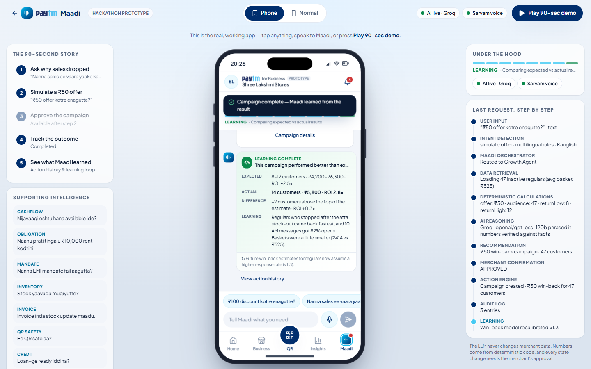 |

| Home | Receive a payment (Paytm staging) |
| --- | --- |
| 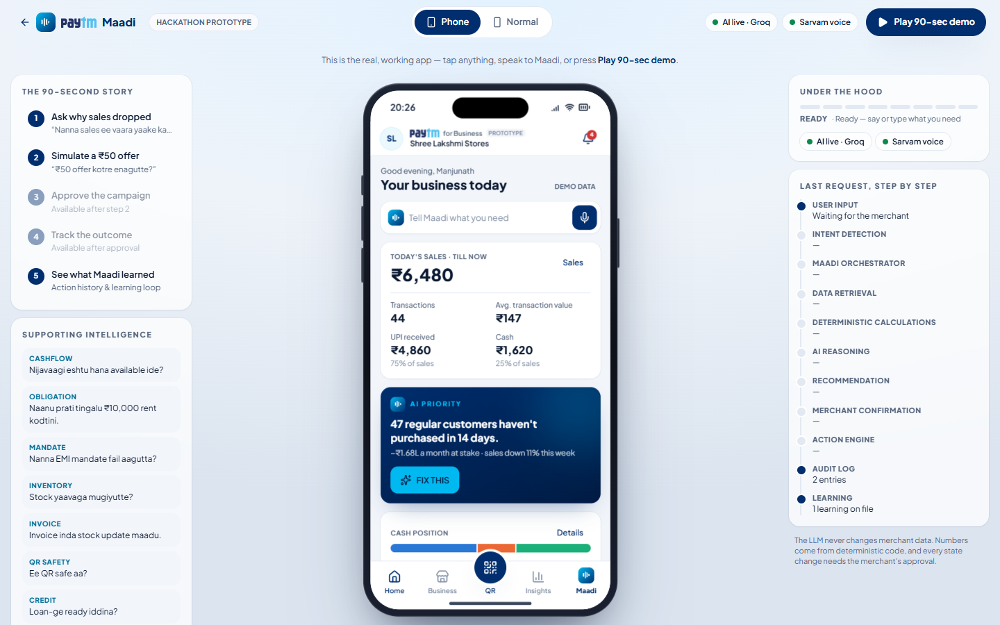 | 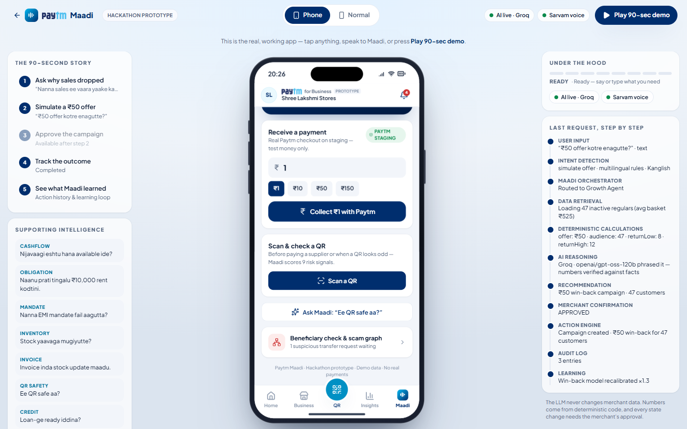 |

| Wrong-person transfer gate + scam graph | Animated product demo on the landing page |
| --- | --- |
| 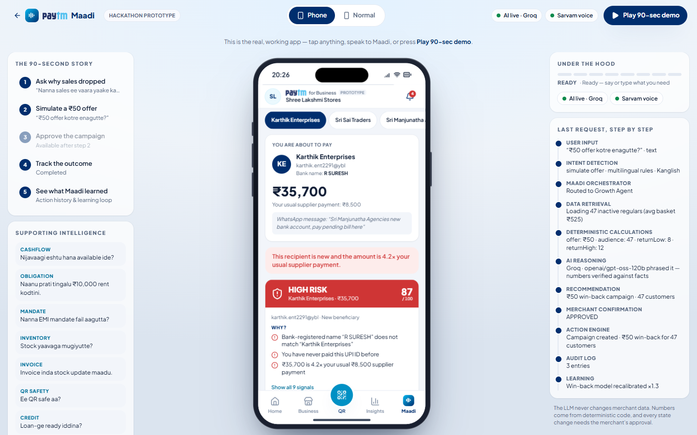 | 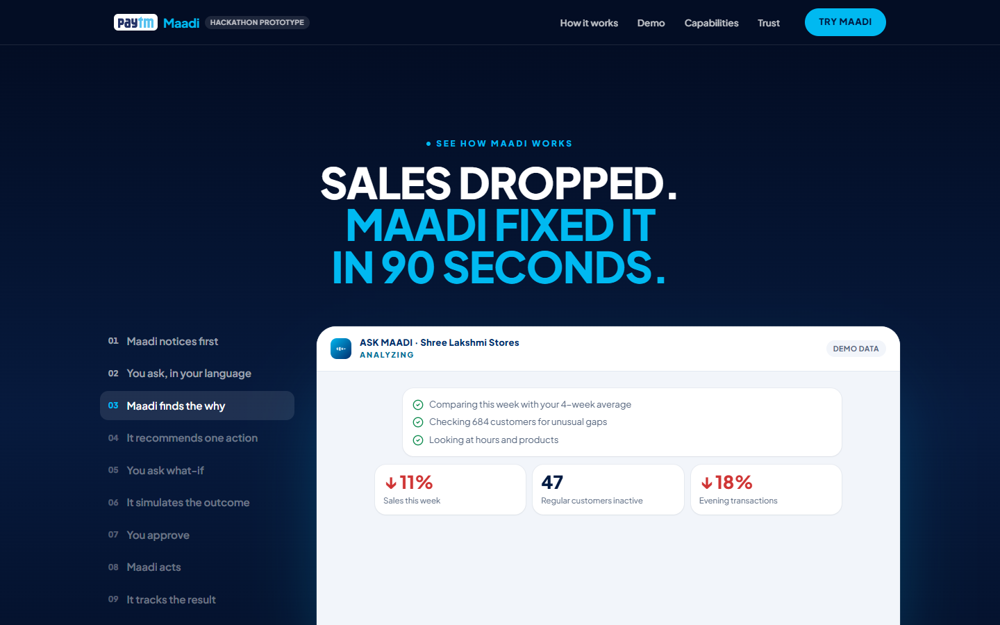 |

| One Maadi brain | On a real phone (full-screen) |
| --- | --- |
| 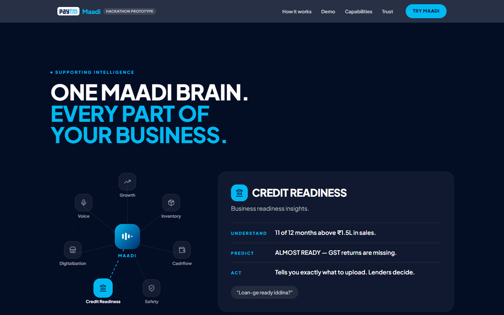 | 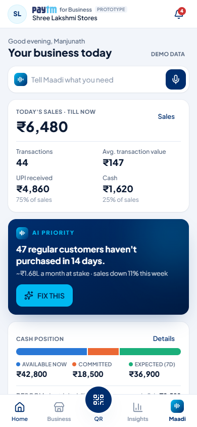 |

---

## Architecture

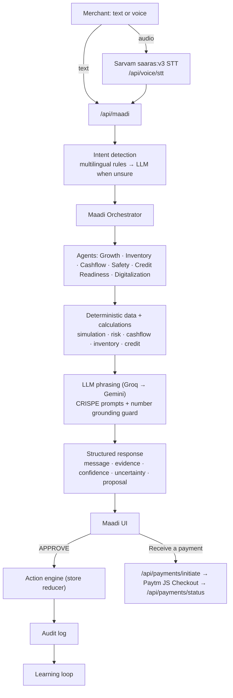

### Principles
- **AI vs deterministic, clearly separated.** The LLM only handles intent, language and explanation. Balances, totals, stock, risk scores, simulation maths, dates and every state change are plain TypeScript.
- **Grounded answers.** When an LLM rephrases a reply, `src/lib/ai/guard.ts` rejects it if it contains any number not present in the agent's facts, and the deterministic answer is used instead.
- **Structured outputs.** Every LLM call is schema-constrained (Groq `json_schema`, Gemini `responseJsonSchema`) and validated with Zod.
- **CRISPE prompts.** Each agent has an explicit Context · Role · Instructions · Steps · Personality · Examples prompt with few-shot examples (`src/lib/agents/prompts.ts`).
- **Resilient providers.** Text requests try **Groq → Gemini → Anthropic**; document reading tries a chain of Gemini models (3.5 Flash → 2.5 Flash → 3.5 Flash-Lite) because popular models return 503 under load. Any failure falls back to the deterministic answer, so the demo never breaks.
- **Approval before action.** Agents only *propose*; the action engine executes after the merchant approves, and records an audit entry.
- **Calibrated story data.** `src/lib/data` generates 12 months of daily sales, 684 customers (exactly 47 inactive regulars), 32 products, 5 suppliers, obligations, mandates, beneficiaries, QR samples and documents, all consistent with the story numbers.
- **One app, two presentations.** `PresentationWrapper` keeps an identical element tree in Phone and Normal mode, so toggling never resets state. State lives in a single React store persisted to `sessionStorage`, with the current screen mirrored in the URL hash (deep links and the back button work).

---

## Tech stack

| Area | Choice |
| --- | --- |
| Framework | Next.js 15 (App Router), React 19, TypeScript |
| Styling & motion | Tailwind CSS v4, Framer Motion, Lucide icons |
| Charts | Recharts (every chart has an accessible table view) |
| Language models | Groq `openai/gpt-oss-120b` (primary), Google Gemini (fallback + vision), Anthropic Claude (optional) |
| Speech | Sarvam AI `saaras:v3` (STT) and `bulbul:v3` (TTS) |
| Payments | Paytm Payment Gateway **staging** — JS Checkout, Transaction Status API, official `paytmchecksum` |
| Validation | Zod |

---

## Getting started

### Prerequisites
- **Node.js 20 or newer** (developed on Node 22) and npm
- Optional API keys (see below) — the app works fully without them in demo mode

### Install and run

```bash
git clone https://github.com/yadavahc/paytm-hackathon.git
cd paytm-hackathon
npm install
cp .env.example .env.local   # then fill in any keys you have (all optional)
npm run dev                  # http://localhost:3000
```

If port 3000 is busy, pick another: `npx next dev -p 3100`.

### Production build

```bash
npm run build
npm start                    # or: npx next start -p 3100
```

### Routes

| Route | What it is |
| --- | --- |
| `/` | Landing page |
| `/app` | Live application (Phone ↔ Normal) |
| `/app#/maadi`, `/app#/qr`, … | Deep link to any screen |
| `/demo` | Live application that auto-plays the 90-second story |

---

## Environment variables

Create `.env.local` from `.env.example`. **Every variable is optional**; keys are read only in server route handlers and never reach the browser. `GET /api/health` reports which capabilities are active without exposing any key.

| Variable | Default | Enables |
| --- | --- | --- |
| `GROQ_API_KEY` | — | Primary language model for intent understanding and grounded replies |
| `GROQ_MODEL` | `openai/gpt-oss-120b` | Groq model override |
| `GEMINI_API_KEY` | — | Text fallback and real document/invoice reading |
| `GEMINI_TEXT_MODEL` | `gemini-3.5-flash-lite` | Gemini model for text fallback |
| `GEMINI_VISION_MODEL` | `gemini-3.5-flash` | First Gemini model tried for documents |
| `ANTHROPIC_API_KEY` | — | Optional further text/vision fallback |
| `SARVAM_API_KEY` | — | Live Indian-language speech-to-text and spoken replies |
| `PAYTM_MID` | — | Paytm **staging** merchant ID |
| `PAYTM_MERCHANT_KEY` | — | Paytm staging merchant key (16 characters) |
| `PAYTM_ENV` | `staging` | Only `staging` is accepted — production is deliberately refused |
| `NEXT_PUBLIC_PAYTM_LOGO_PATH` | `/brand/paytm-logo.png` | Official logo asset under `/public` (plain text is shown if unset) |

**Without keys:** replies use grounded templates, voice is simulated, documents use sample templates, and payments are recorded as clearly labelled simulations.

---

## Demo script for judges

1. Open **`/app`** (Phone mode on desktop). Home shows today's business, an **AI Priority** card, cash position, inventory and safety alerts.
2. Tap **FIX THIS** or the mic and say *"Nanna sales ee vaara yaake kadime aagide?"* — see the −11% insight, evidence and *Why Maadi thinks this*.
3. Tap **See plan** / say *"₹50 offer kotre enagutte?"* — review the simulated estimate and assumptions. Try **EDIT** to change the offer and watch it re-simulate.
4. Switch to **▣ Normal** in the top bar — nothing resets. Switch back.
5. **APPROVE** — the campaign starts; tap **Skip to day 7** to see +14 customers, ₹5,800, ROI 2.8× and **LEARNING COMPLETE**.
6. Explore supporting intelligence with these prompts:

| Try saying | Shows |
| --- | --- |
| *Nijavaagi eshtu hana available ide?* | Available vs committed vs expected cash |
| *Naanu prati tingalu ₹10,000 rent kodtini.* | Confirms a detected rent payment without double-counting |
| *Supplier-ge ₹12,000 Friday kodbeku.* | Records a promised supplier payment |
| *Nanna EMI mandate fail aagutta?* | UPI mandate failure prediction and a safe reminder |
| *Stock yaavaga mugiyutte?* | Stock-out prediction and a supplier order |
| *Invoice inda stock update maadu.* | Invoice extraction → stock update (fixes the atta stock-out) |
| *Ee QR safe aa?* | Nine-signal risk explanation for a fake counter sticker |
| *Loan-ge ready iddina?* | Credit readiness with improvements |
| *Ee biscuit packet ₹10, 25 pieces ide.* | Digital catalog item |
| *Mere sales is hafte kyun kam hue?* / *Why are my sales down this week?* | Hinglish / English |

7. Open the **QR** tab → **Receive a payment** to try the Paytm staging checkout.
8. Or open **`/demo`** and let the whole story play itself, including the supporting moments.

The right-hand **Under the hood** panel (wide screens) shows each request's pipeline live: input → intent → agent → data → calculations → AI reasoning → recommendation → confirmation → action → audit → learning.

---

## API reference

All routes run on the Node.js runtime and validate their input.

| Method & route | Body | Returns |
| --- | --- | --- |
| `GET /api/health` | — | `{ ai, provider, model, fallbacks, vision, voice, payments }` |
| `POST /api/maadi` | `{ text, preferredLanguage: "kn" \| "hi" \| "en", forceDemo, context }` | `{ response, mode: "live" \| "demo" }` — intent, agent, message, cards, evidence, confidence, uncertainty, optional proposal |
| `POST /api/voice/stt` | `multipart/form-data` with `file` (browser recording) | `{ transcript, languageCode }` · 503 in demo mode · 422 if nothing was heard |
| `POST /api/voice/tts` | `{ text, language }` | `{ audio (base64 WAV), mime }` · 503 in demo mode |
| `POST /api/documents/extract` | `multipart/form-data` with `file` (PNG/JPG/WebP/PDF, ≤ 5 MB) | `{ extracted, engine }` · 503 in demo mode |
| `POST /api/payments/initiate` | `{ amount (₹1–₹1,00,000), note? }` | `{ orderId, txnToken, amount, mid, scriptUrl }` · 502 with Paytm `code` and `hint` if Paytm refuses |
| `POST /api/payments/status` | `{ orderId }` | `{ status: TXN_SUCCESS \| TXN_FAILURE \| PENDING \| NO_RECORD_FOUND, code, message, txnId?, paymentMode? }` |

### How test payments work
1. `/api/payments/initiate` signs the request with Paytm's official `paytmchecksum` library and calls **Initiate Transaction** on `securestage.paytmpayments.com` (`websiteName: WEBSTAGING`).
2. The browser loads Paytm JS Checkout for the MID and opens it with the transaction token (`redirect: false`).
3. When checkout reports back, `/api/payments/status` calls Paytm's **Transaction Status** API. A payment only counts in *Today's sales* when Paytm itself returns `TXN_SUCCESS`; the browser's result alone is never trusted.

---

## Project structure

```
src/
  app/
    page.tsx                  Landing page
    app/page.tsx              Live application
    demo/page.tsx             Auto-playing demo
    api/                      maadi · health · voice/stt · voice/tts · documents/extract · payments/initiate · payments/status
  components/
    landing/                  Hero, problem, loop, how-it-works, product demo, capabilities, voice, trust, CTA
    app-shell/                MaadiApplication, stage (top bar, demo guide, under-the-hood), screen registry
    presentation-mode/        Phone ↔ Normal context, switcher, wrapper
    phone-frame/              Smartphone frame
    maadi/ · chat/ · voice/   Command center, response cards, approval sheets, voice overlay
    home/ business/ customers/ inventory/ cashflow/ campaigns/ insights/
    safety/ credit/ documents/ catalog/ history/ settings/ payments/ demo/
    paytm-header/ bottom-nav/ ui/
  lib/
    agents/                   Orchestrator, Growth/Inventory/Cashflow/Safety/Credit/Digitalization agents, CRISPE prompts
    ai/                       Intent detection, LLM providers, schemas, grounding guard, client
    data/                     Calibrated seed data and story constants
    simulation/ risk/ cashflow/ inventory/ credit/
    payments/                 Paytm staging client (server) and JS Checkout loader (browser)
    voice/                    Sarvam STT/TTS
    store/                    Store types, reducer/action engine, selectors, provider
public/brand/                 Paytm logo
docs/screenshots/             README images
```

---

## Safety, privacy and trust

- **No real money.** Payments use Paytm's staging gateway only; `PAYTM_ENV` values other than `staging` are refused.
- **Merchant approval.** Every state-changing action needs APPROVE, and is recorded in the audit log.
- **Server-side secrets.** All API keys stay in server route handlers; `.env.local` is git-ignored.
- **Explainability and uncertainty.** Evidence, *Why Maadi thinks this*, confidence labels and explicit uncertainty on every important answer. Simulations are labelled **SIMULATED ESTIMATE**.
- **No invented fraud data.** Risk signals come only from the merchant's own (demo) history; Maadi never claims access to external fraud databases.
- **Credit is guidance only.** Maadi never approves or rejects loans.
- **Accessibility.** Keyboard navigation, visible focus, screen-reader labels, large tap targets, table views for charts, and `prefers-reduced-motion` support.

---

## Troubleshooting

| Symptom | Fix |
| --- | --- |
| `EADDRINUSE` on port 3000 | Run on another port: `npx next dev -p 3100` |
| Badge says **Demo mode** | No LLM key is set, or *Settings → AI engine* is on *Demo (deterministic)* |
| **Paytm 239: System Error** when collecting a payment | The staging MID isn't enabled for payments yet. Check Test mode in the Paytm dashboard (Developer Settings → API Keys) or contact Paytm support. Use *Record as simulated instead* meanwhile |
| **Paytm 2005: Checksum provided is invalid** | `PAYTM_MERCHANT_KEY` doesn't match `PAYTM_MID` |
| Microphone does nothing | Allow microphone access. Browsers only allow it on `https://` or `localhost` |
| Document upload uses a sample template | Set `GEMINI_API_KEY`; Gemini models occasionally return 503 under load, and the app tries a chain of models before falling back |
| Want to restart the story | *Settings → Reset demo*, or open `/demo` |

---

## Limitations and roadmap

- State is session-scoped (`sessionStorage`) to keep the demo zero-setup; the action engine is the seam for a real database.
- The merchant, customers and transactions are simulated; real Paytm merchant data integration would replace `src/lib/data`.
- Campaign messages are simulated (no WhatsApp/SMS sending).
- Test payments require a Paytm staging MID with payments enabled.
- Next: real merchant data connectors, persisted audit and learning history, WhatsApp campaign delivery, and more Indian languages.

---

## Disclaimer

Paytm Maadi is a hackathon prototype. It is not affiliated with, endorsed by, or an official product of Paytm. The Paytm name and logo are trademarks of their respective owner and are used here for prototype presentation only.
